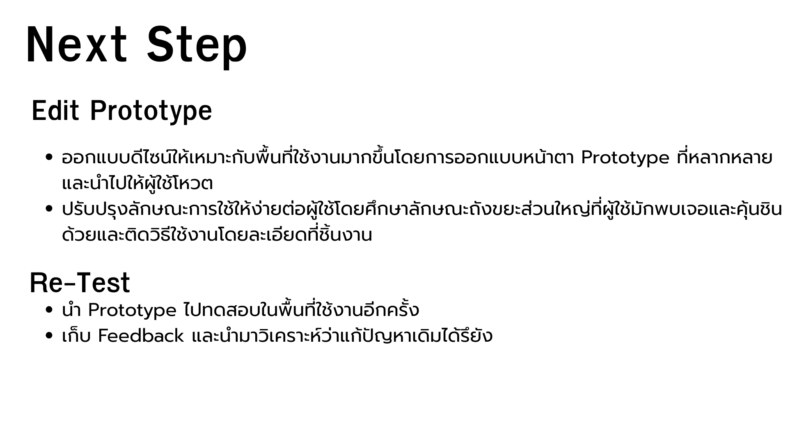

# Define
## Problem We Found 
1.แหล่งน้ำเหม็น 
2.ทางเดินแคบ 
3.เครื่องออกกำลังกายซ่อมช้า 
4.เครื่องออกกำลังกายไม่หลากหลาย 
5.ในห้องน้ำไม่มีตระกร้าขยะ 
## Problem we choose : ในห้องน้ำไม่มีตระกร้าขยะ
เพราะว่าเป็นปัญหาที่แก้ได้ที่ง่ายสุด ประหยัดงบที่สุด แต่ได้ผลลัพธ์ที่เห็นชัดและคุ้มค่าที่สุดแถมยังส่งผลต่อไปหาอื่น เช่น แหล่งน้ำมีกลิ่นเหม็นลดลงเพราะเมื่อเราเพิ่มถังขยะเข้ามาจะลดขยะที่ตกลงน้ำจากการทิ้งไม่เป็นที่ได้

