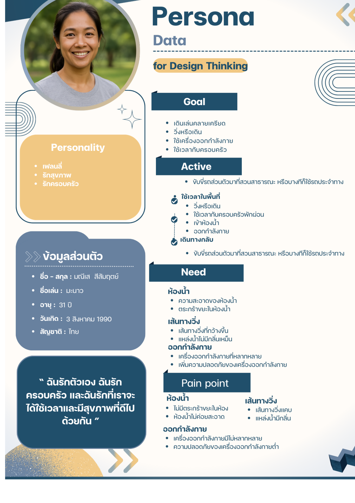
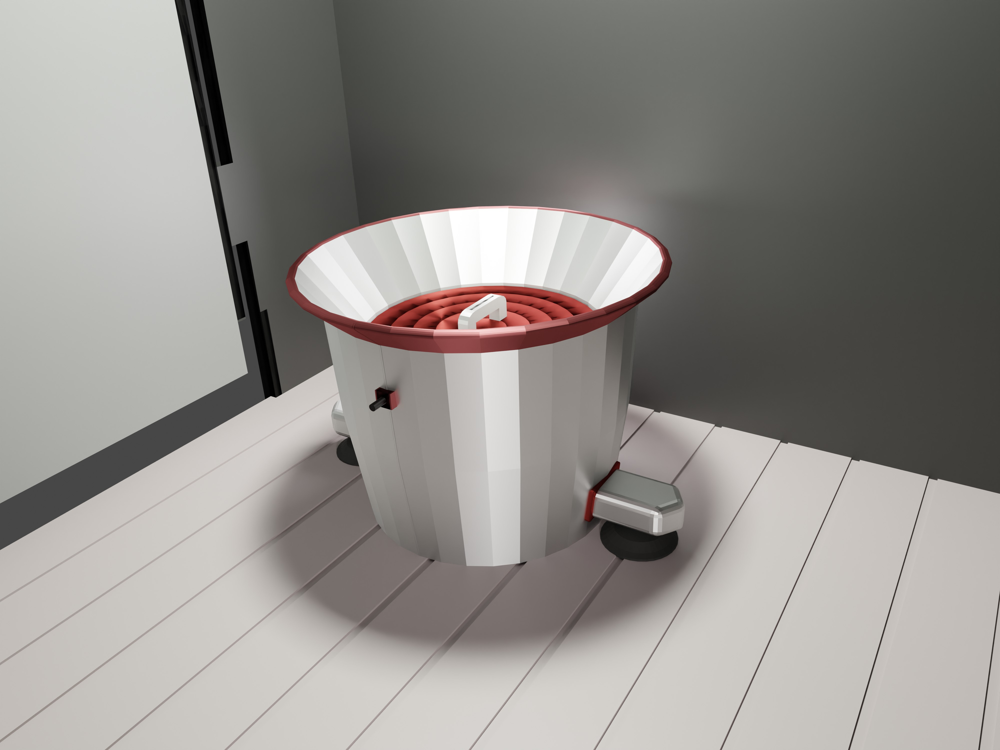

# ✨ Interview Script  
## 🙋‍♂️ Introduce Myself  
สวัสดีครับ พวกผมเป็นนักศึกษาจากมหาวิทยาลัยเทคโนโลยีพระจอมเกล้าธนบุรี อยากขอเวลาสั้น ๆ ประมาณ **5–10 นาที** เพื่อสัมภาษณ์ความเห็น ไม่ทราบว่าสะดวกให้สัมภาษณ์ไหมครับ?  

---

## 🌿 Question for Relax  
1. ถ้าให้เลือก **“จุดที่ชอบที่สุด”** ในสวนนี้ จะเลือกตรงไหน?  
2. วันนี้ตั้งใจเลือกมาสวนธนฯ เพราะอะไรครับ?  

---

## ❓ Question  
1. ปกติมาสวนธนฯ บ่อยแค่ไหนครับ?  
2. เวลามาที่นี่ มาทำกิจกรรมอะไร?  
3. ชอบมาในช่วงเวลาไหนของวันมากที่สุด? ⟶ **ถามต่อว่าเพราะอะไร**  
4. เวลามาที่นี่ ปกติมาคนเดียวหรือมากับใครบ่อยที่สุด?  
5. คุณเดินทางมาสวนธนฯ ยังไงครับ?  
6. ใช้เวลาในการเดินทางมาที่สวนธนฯ กี่นาทีครับ?  
7. ช่วยบอกสิ่งที่คุณชอบที่สุดในการมาสวนธนฯ หน่อยครับ?  
8. ทำไมถึงเลือกมาที่สวนธนฯ อะไรที่นี่พิเศษกว่าที่อื่น?  
9. ถ้าปรับปรุงได้ 1 อย่าง อยากให้เปลี่ยนอะไรในสวนนี้?  
10. ถ้าไม่มีสวนธนฯ คุณคิดว่าคุณจะไปที่ไหนแทน?  
11. มีอะไรทำให้รู้สึกไม่สะดวกหรือไม่ชอบเวลามาที่นี่ไหมครับ?  
12. แล้วถ้าต้องให้คะแนนสวนนี้เต็ม 10 คะแนน คุณจะให้กี่คะแนนครับ?  

---

# 🔎 Define  
## 🚧 Problem We Found  
1. แหล่งน้ำเหม็น  
2. ทางเดินแคบ  
3. เครื่องออกกำลังกายซ่อมช้า  
4. เครื่องออกกำลังกายไม่หลากหลาย  
5. ในห้องน้ำไม่มีตะกร้าขยะ  

---

# 💡 Empathize  

## 🟨 WHAT – HOW – WHY  
### 🟢 What  
คนมาออกกำลังกายเพื่อดูแลสุขภาพร่างกายให้แข็งแรง ลดความเสี่ยงจากโรคต่าง ๆ  

### 🟠 How  
1. วิ่ง  
2. เดิน  
3. เวทเทรนนิ่ง  
4. เล่นเครื่องเล่นออกกำลังกาย  

### 🔵 Why  
เหตุผลหลักที่คนมาออกกำลังกายคือเพื่อสุขภาพที่ดีขึ้น 💪  
นอกจากนี้ยังต้องการ **ปรับรูปร่าง**, **เพิ่มความมั่นใจ**, และ **สุขภาพจิตที่แข็งแรง**  

---

## 🗣 SAY  
- ที่นี่อากาศดีมากครับ  
- ห้องน้ำไม่มีถังขยะแยกในแต่ละห้อง  
- ทางเดินสะอาดดีค่ะ  
- แหล่งน้ำส่งกลิ่นเหม็น  
- สนามเด็กเล่นมีเครื่องเล่นไม่หลากหลาย  

## 👣 DO  
- มาเดินออกกำลังกายกับครอบครัว  
- ต้องถือขยะออกมาทิ้งข้างนอก  
- มาวิ่งออกกำลังกาย  
- นั่งรับประทานอาหารกับครอบครัว  
- มารอหลานเล่นสนามเด็กเล่น  

## 💭 THINK  
- สวนธนอากาศดี น่าพาครอบครัวมาออกกำลังกาย  
- น่าจะมีถังขยะแยกในทุกห้องน้ำ  
- ทางเดินสะอาดดี น่าวิ่งออกกำลังกาย  
- ควรมีการปรับปรุงแหล่งน้ำ  
- ควรมีเครื่องเล่นมากกว่านี้  

## 💖 FEEL  
- 😊 รู้สึกดีมาก เพราะบรรยากาศสดชื่น  
- 😕 รู้สึกลำบาก เพราะไม่มีถังขยะในห้องน้ำ  
- 😀 รู้สึกดี เพราะทางเดินสะอาด  
- 😒 รู้สึกไม่ดี เพราะกลิ่นน้ำเหม็น  
- 😞 รู้สึกผิดหวัง ที่เครื่องเล่นน้อย  

---

## 🔍 Inferred Think and Feel  
- ผู้ใช้ส่วนมากพึงพอใจเพราะสิ่งแวดล้อมดี  
- ผู้ใช้ต้องการถังขยะเพิ่มมากขึ้น  
- ผู้ใช้ผิดหวังเพราะเครื่องเล่นไม่เพียงพอ  
- ผู้ใช้ต้องการวิธีแก้ปัญหาแหล่งน้ำเหม็น  

---

# 👤 Persona  

## 🌟 Personality  
- เฟรนด์ลี่ 🤝  
- รักสุขภาพ 🏃‍♂️  
- รักครอบครัว 👨‍👩‍👧  

## 📌 ข้อมูลส่วนตัว  
- **ชื่อ - สกุล:** มนัส ส้มมุตภูมิ  
- **ชื่อเล่น:** มะนาว  
- **อายุ:** 31 ปี  
- **วันเกิด:** 3 สิงหาคม 1990  
- **สัญชาติ:** ไทย  

> “ฉันรักตัวเอง ฉันรักครอบครัว และฉันรักที่เราจะได้ใช้เวลาและมีสุขภาพที่ดีไปด้วยกัน”  

---

## 🎯 Goal  
- เดินเล่นคลายเครียด  
- วิ่งหรือเดิน  
- ใช้เครื่องออกกำลังกาย  
- ใช้เวลากับครอบครัว  

---

# 🗺 Journey Map  
| เวลา  | กิจกรรม | ความรู้สึก |
|-------|---------------------------------------------------|------------|
| 15.30 | เดินทางมาที่สวนธน | 😀 ดี |
| 16.00 | วิ่งออกกำลังกาย | 😍 ดีมาก |
| 16.30 | พัก–ทานอาหาร แต่กลิ่นน้ำเหม็น | 😒 ไม่ดี |
| 17.00 | วิ่งออกกำลังกายอีกครั้ง | 🙂 ดี |
| 17.45 | เข้าห้องน้ำไม่เจอถังขยะ | 😕 ไม่ค่อยดี |
| 18.30 | วิ่งชนคน เพราะทางเดินแคบ | 😔 ไม่ดี |

---

# 💡 Insight  
1. ห้องน้ำสกปรกเพราะไม่มีถังขยะ  
2. ถังขยะในสวนมีน้อย ทำให้ขยะกระจายตามพื้นที่  
3. ระบบบำบัดน้ำเสียไม่ทั่วถึง → น้ำส่งกลิ่นเหม็น  

---

# 📝 PoV Statement  
| **Point of view** | เนื้อหา |
|--------------------|-------------------------------------------|
| **We met**        | คุณแอ ที่สวนธนบุรี มจธ. |
| **We were**       | พบว่าสวนร่มรื่น แต่ห้องน้ำไม่ดี |
| **We wonder**     | ห้องน้ำไม่มีถังขยะ → ขยะบนพื้นเยอะ |
| **It would change** | ติดตั้งถังขยะที่ทนทานและยึดแน่นในห้องน้ำ |

---

# 💡 Ideate  
## Brainstorm  
1. 🤖 หุ่นยนต์เก็บขยะอัตโนมัติ  
2. 🗑 ถังขยะเปิด–ปิดอัตโนมัติ  
3. 💧 หุ่นยนต์บำบัดน้ำ–ฟอกกลิ่น  
4. 🚰 เครื่องปั๊มน้ำบำบัดเคลื่อนที่  
5. 🗑 ถังขยะในห้องน้ำ  
---
## Final Eleted
🗑 ถังขยะในห้องน้ำ  : เพราะเป็นปัญหาที่แก้ง่ายและส่งผลกระทบกว้าง(ผู้ใช้อารมณ์ดีขึ้น,เพิ่มปริมาณถังขยะในสถานที่)

# 🛠 Prototype  
  

**Feature**  
- ทำจากสแตนเลสน้ำหนักเบา  
- ถอดล้างง่าย  
- ล็อกติดด้วยระบบสุญญากาศ  

---

# 📊 Test Script  
**Target:** ผู้ใช้ห้องน้ำสวนธนฯ  
**How:** สัมภาษณ์หลังติดตั้ง Prototype  

**Question:**  
- รู้สึกอย่างไรเมื่อมีถังขยะ?  
- คิดว่าจะช่วยลดขยะได้ไหม?  
- อยากให้มีอะไรเพิ่มในห้องน้ำ?  
- ถ้าเป็นนักพัฒนาห้องน้ำ จะทำอะไร?  

---
## Story Telling and Story Board 
### Story Board 
  
### Story Telling 
1.รอกลุ่มเป้าหมายเข้าห้องน้ำ   
2.รอกลุ่มเป้าหมายออกมา   
3.เข้าหากลุ่มเป้าหมาย   
4.สอบถามเกี่ยวกับ prototype   
5.บันทึกข้อมูล 

# 📑 Feedback Form Test  
## ✅ Positive  
1. ขยะในสวนจะลดลงเพราะถังขยะเยอะขึ้น  
2. ปากถังกว้าง ใช้ง่ายขึ้น  

## ❌ Negative  
1. ขยะยังลดไม่มาก เพราะปัญหาหลักไม่ใช่แค่จำนวนถัง  
2. ดีไซน์แปลก ไม่คุ้นตา  
3. ดูใช้งานยาก  

---

# 🚩 Mode Issue  
## Mode  
- วิเคราะห์ข้อมูลจาก Define → ปรับปรุง Prototype  
- วิเคราะห์พฤติกรรมผู้ใช้งานเพื่อหาจุดที่ควรแก้ไข  

## Issue to Work  
1. Design แปลกเกินไป → ทำให้เรียบง่ายขึ้น  
2. ผู้ใช้งานไม่เข้าใจวิธีใช้ → ปรับ UX และเพิ่มคำแนะนำ  

---

# 📌 What to Do Next!  
1. ปรับดีไซน์ Prototype ให้เหมาะสมกับพื้นที่จริง  
2. สร้าง Prototype หลายเวอร์ชั่น และเก็บโหวตจากผู้ใช้  
3. Re-Test ในพื้นที่จริง พร้อมเก็บ Feedback  

---

# 📣 Show & Share  
## Week 1  
**Like:** เนื้อหาครบถ้วน, การนำเสนอข้อมูลดี  
**Wish:** ข้อมูลบางส่วนควรย่อ, คำถามเยอะไป  

## Week 2  
**Like:** หน้าตาชิ้นงานเท่, ตอบโจทย์, Persona ทำได้ดี  
**Wish:** ไม่ชอบดีไซน์ที่เหมือนไม้ดูดส้วม, อยากให้มีฝาปิด  

---

# 👥 สมาชิกทีม  
- **นายธนวิชญ์ จันทวงค์ 68130500124** → ตั้งคำถาม, ทำสไลด์, Empathy, Journey Map, Insight  
- **นายอธิฐาน เสนผาบ 68130500078** → ข้อมูลลง Github, ออกแบบ Prototype, สไลด์, Persona  
- **นายก้องภพ ก้อนทรัพย์ 68130500082** → เก็บแบบสำรวจ, Feedback, สไลด์, Test Script, What–How–Why  
- **น.ส.พัชรศร ปันปิน 68130500135** → ตั้งคำถาม, สไลด์ Ideate, Mode Issue, Next Step  
- **นายภาคิณ ชวาลปัญญา 68130500127** → เก็บแบบสำรวจ, Feedback, สไลด์, Test Script, PoV  
- **นายศุภกฤษฏิ์ อ่วมศิริ 68130500106** → พรีเซนต์, คลีนข้อมูล, สไลด์, Mode Issue, Next Step  
