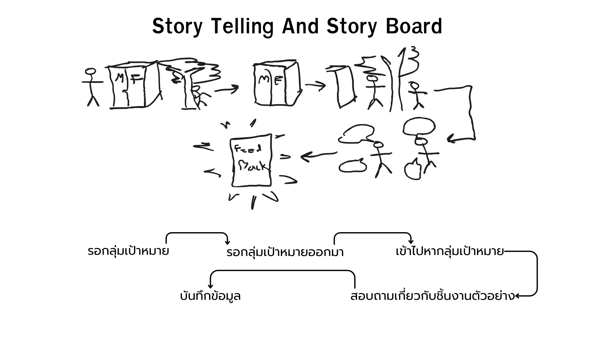

# Define
## Problem We Found 
1.แหล่งน้ำเหม็น 
2.ทางเดินแคบ 
3.เครื่องออกกำลังกายซ่อมช้า 
4.เครื่องออกกำลังกายไม่หลากหลาย 
5.ในห้องน้ำไม่มีตระกร้าขยะ 
## Problem we choose : ในห้องน้ำไม่มีตระกร้าขยะ
เพราะว่าเป็นปัญหาที่แก้ได้ที่ง่ายสุด ประหยัดงบที่สุด แต่ได้ผลลัพธ์ที่เห็นชัดและคุ้มค่าที่สุดแถมยังส่งผลต่อไปหาอื่น เช่น แหล่งน้ำมีกลิ่นเหม็นลดลงเพราะเมื่อเราเพิ่มถังขยะเข้ามาจะลดขยะที่ตกลงน้ำจากการทิ้งไม่เป็นที่ได้

# PROTOTYPE

# Feature
1.ทำจากสแตนเลทน้ำหนักเบาไม่เป็นสนิม 
2.ถอดล้างทำความสะอาดง่าย 
3.ระบบล็ฮคติดแบบสุญญากาศทำให้ติดตั้งง่ายไม่สร้างความเสียหายต่อพื้นที่  

# นายธนวิชญ์ จันทวงค์ 68130500124
ตั้งคำถามสำหรับถาม,ทำสไลด์,Empathy,JourneyMap,Insight
# นายอธิฐาน เสนผาบ 68130500078
นำข้อมูลใส่ในGithub,ออกแบบ Prototype,ทำสไลด์,Persono
# นายก้องภพ ก้อนทรัพย์ 68130500082
ลงพื้นที่เก็บแบบสำรวจ,เก็บFeedBack,ทำสไลด์,Testscrip,Feedback,What How Why
# นางสาวพัชรศร ปันปิน 68130500135
ตั้งคำถามสำหรับถาม,ทำสไลด์Ideate,ทำสไลด์,Mode Issuse,Nextstep
# นายภาคิณ ชวาลปัญญา 68130500127
ลงพื้นที่เก็บแบบสำรวจ,เก็บFeedBack,ทำสไลด์,Testscrip,Feedback,PoV
# นายศุภกฤษฏิ์ อ่วมศิริ 68130500106
พรีเซนต์นำเสนอผลงาน,คลีนข้อมูล,ทำสไลด์,Mode Issuse,Nextstep

