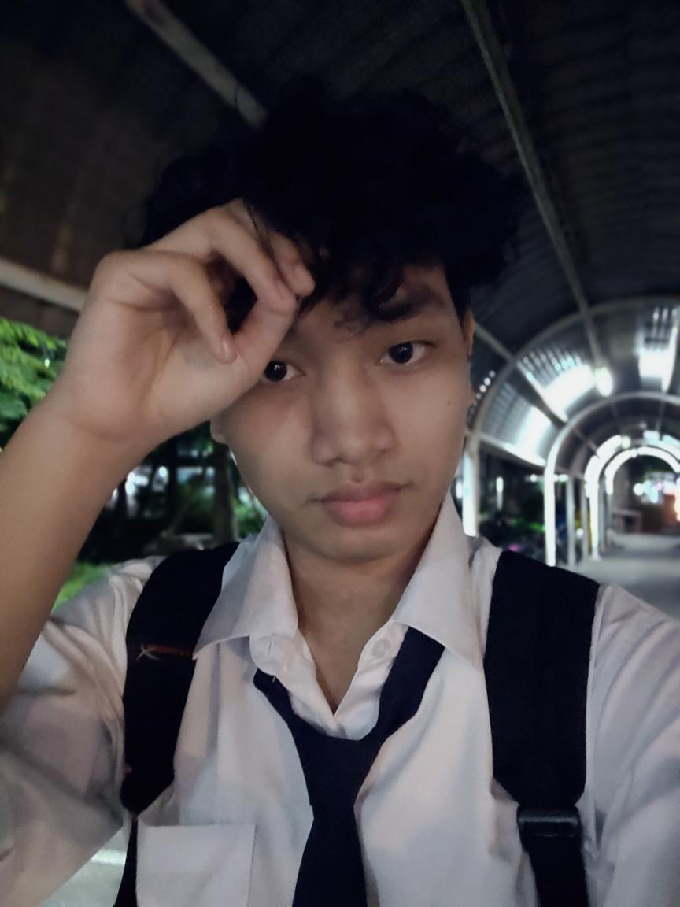
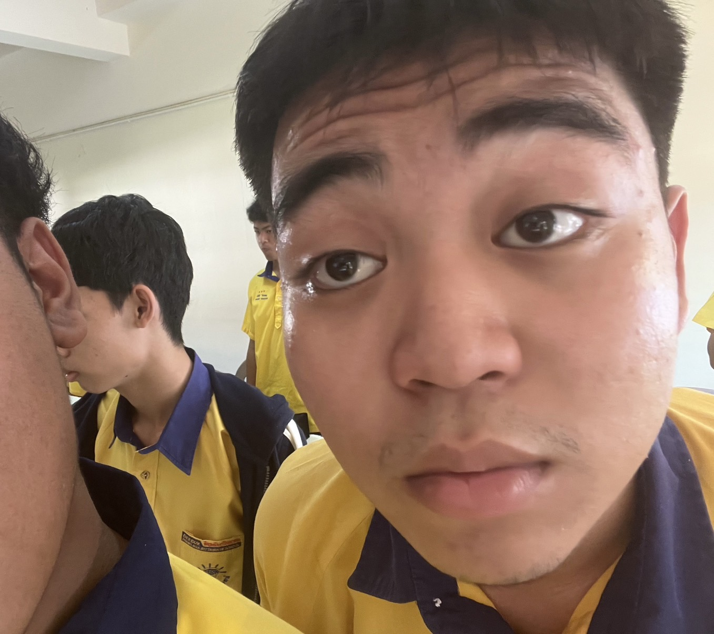
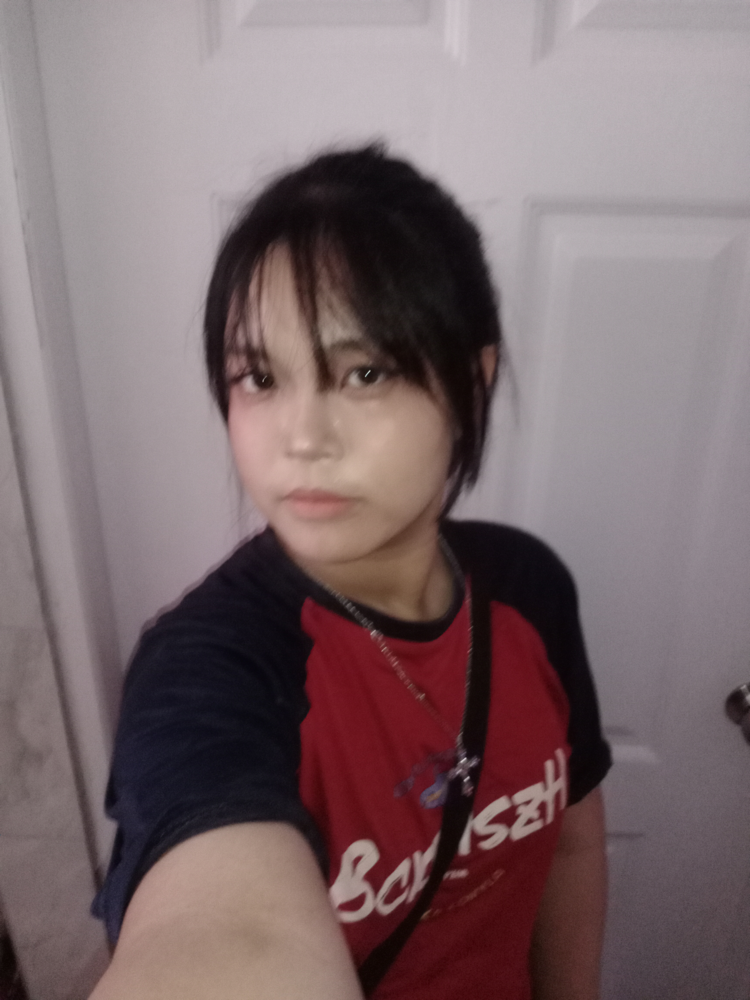
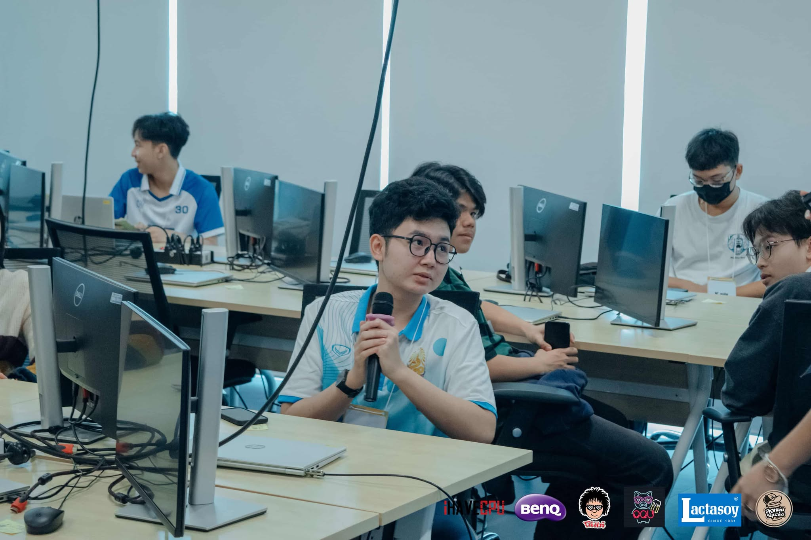
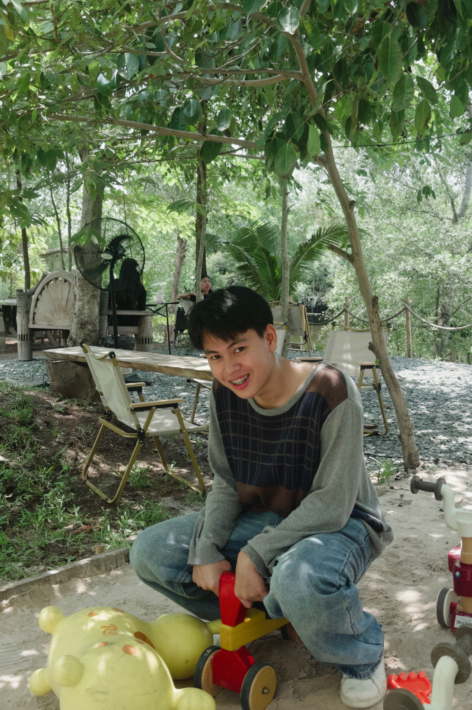

# 🎉 รีวิวเพื่อน 🎉

---

## **บีมมมม บีมหมวกแก็ป** 😏

- **ชื่อจริง** : ธนวิชญ์ จันทวงค์  
- **ชื่อเล่น** : บีม  
- **อายุ** : 18  
- **นิสัย** : ชิลๆ  

### 💡 10 คำถามเพิ่มความเข้าใจ
1. ว่างๆ ชอบทำอะไร : นอนเลื่อน TikTok  
2. ฟังเพลงแนวไหน : Jazz  
3. อาหารที่ชอบ : ของหวาน  
4. หนัง/ซีรีส์ที่ดูซ้ำ : ไม่มี  
5. เหตุการณ์ฮาๆ : เพื่อนหลับแล้วครูมาปลุก  
6. ที่เที่ยวในฝัน : จีน  
7. งานอดิเรก : เลื่อนโซเชียล  
8. สิ่งที่ทำให้แฮปปี้ : ฟังเพลง  
9. เป้าหมายเล็กๆ ที่ภูมิใจ : หยอดเงินวันละ 20 บาท  
10. อยากเรียนรู้ : การเป็นนายทุน  

---

## **โฟกัสส**

- **ชื่อจริง** : อธิฐาน เสนผาบ  
- **ชื่อเล่น** : โฟกัส  
- **อายุ** : 18  
- **นิสัย** : เป็นมิตร  

### 💡 10 คำถามเพิ่มความเข้าใจ
1. ว่างๆ ชอบทำอะไร : เล่นเกม  
2. ฟังเพลงแนวไหน : Pop / Jazz  
3. อาหารที่ชอบ : อิตาลี  
4. หนัง/ซีรีส์ที่ดูซ้ำ : ไม่มี  
5. เหตุการณ์ฮาๆ : ฮาทุกวัน ลืมทุกวัน  
6. ที่เที่ยวในฝัน : เนเธอร์แลนด์  
7. งานอดิเรก : นอน  
8. สิ่งที่ทำให้แฮปปี้ : เล่นเกม  
9. เป้าหมายเล็กๆ ที่ภูมิใจ : วางปากกาบนปลายนิ้ว  
10. อยากเรียนรู้ : เทควันโด  

---

## **ต้นปี**

- **ชื่อจริง** : ก้องภพ ก้อนทรัพย์  
- **ชื่อเล่น** : ต้นปี  
- **อายุ** : 18  
- **นิสัย** : สบายๆ เรื่อยๆ  

### 💡 10 คำถามเพิ่มความเข้าใจ
1. ว่างๆ ชอบทำอะไร : ฟังเพลง 🎵 ดูหนัง 🍿  
2. ฟังเพลงแนวไหน : Jazz 🎷  
3. อาหารที่ชอบ : ทอด 🍳 หุง 🍚 อุ่น 🍞 ตุ๋น 🥩 ต้ม 🍜 นึ่ง 🦀  
4. หนัง/ซีรีส์ที่ดูซ้ำ : ดูครั้งเดียวทุกเรื่อง 👀  
5. เหตุการณ์ฮาๆ : ฮาทุกวัน 😂  
6. ที่เที่ยวในฝัน : สวนสัตว์ 🐻 อควาเรียม 🐋  
7. งานอดิเรก : ดูหนัง 🎬 เดินเล่นสวนสาธารณะ 🌳  
8. สิ่งที่ทำให้แฮปปี้ : กินข้าวครบ 3 มื้อ 😋  
9. เป้าหมายเล็กๆ ที่ภูมิใจ : ทำงานที่ตั้งใจสำเร็จ 💯  
10. อยากเรียนรู้ : ธุรกิจ 💸  

---

## **อิ้งง ✨**

- **ชื่อจริง** : พัชรศร ปันปิน  
- **ชื่อเล่น** : อิ้ง  
- **อายุ** : 18  
- **นิสัย** : ชิลๆ  

### 💡 10 คำถามเพิ่มความเข้าใจ
1. ว่างๆ ชอบทำอะไร : เล่นเกม 🎮 อ่านหนังสือ 📚  
2. ฟังเพลงแนวไหน : Pop / K-pop / R&B / Hip-Hop 🎵  
   - ศิลปินที่ชอบ : Jennie (BLACKPINK), Giselle (AESPA)  
3. อาหารที่ชอบ : อาหารไทย 🥘  
4. หนัง/ซีรีส์ที่ดูซ้ำ : ไม่มี  
5. เหตุการณ์ฮาๆ : มีแต่ลืมไปแล้ว  
6. ที่เที่ยวในฝัน : มัลดิฟส์ 🦭  
7. งานอดิเรก : นอน 🛌 เล่น TikTok 📱  
8. สิ่งที่ทำให้แฮปปี้ : ข้อความจากพ่อแม่ 🗯️  
9. เป้าหมายเล็กๆ ที่ภูมิใจ : นอนครบ 8 ชั่วโมง 😪  
10. อยากเรียนรู้ : ภาษาที่ 3 และการพัฒนาเกม 📖🎲  

---

## **บีมม**

- **ชื่อจริง** : ภาคิณ ชวาลปัญญา  
- **ชื่อเล่น** : บีม  
- **อายุ** : 18  
- **นิสัย** : ดี  

### 💡 10 คำถามเพิ่มความเข้าใจ
1. ว่างๆ ชอบทำอะไร : เล่นเกม ดูหนัง ฟังเพลง  
2. ฟังเพลงแนวไหน : Jazz / Pop / Rock  
3. อาหารที่ชอบ : ประเภทเส้น  
4. หนัง/ซีรีส์ที่ดูซ้ำ : Hospital Playlist  
5. เหตุการณ์ฮาๆ : เคยอุจจาระราดที่โรงเรียน  
6. ที่เที่ยวในฝัน : อินเดีย  
7. งานอดิเรก : เล่นเกม ดูหนัง ฟังเพลง  
8. สิ่งที่ทำให้แฮปปี้ : ทานข้าว  
9. เป้าหมายเล็กๆ ที่ภูมิใจ : แข่งสิ่งประดิษฐ์แล้วได้รางวัล  
10. อยากเรียนรู้ : ธุรกิจ  

---

## **เท็น**

- **ชื่อจริง** : ศุภกฤษฏิ์ อ่วมศิริ  
- **ชื่อเล่น** : เท็น  
- **อายุ** : 18  
- **นิสัย** : ดีสุดๆ  

### 💡 10 คำถามเพิ่มความเข้าใจ
1. ว่างๆ ชอบทำอะไร : นอน ดูหนัง อ่านหนังสือ  
2. ฟังเพลงแนวไหน : Pop  
3. อาหารที่ชอบ : ของหวาน  
4. หนัง/ซีรีส์ที่ดูซ้ำ : Friend Zone  
5. เหตุการณ์ฮาๆ : ตดให้เพื่อนดม  
6. ที่เที่ยวในฝัน : ญี่ปุ่น  
7. งานอดิเรก : นอน  
8. สิ่งที่ทำให้แฮปปี้ : กินข้าวอร่อยๆ  
9. เป้าหมายเล็กๆ ที่ภูมิใจ : แข่งเขียนเว็บ  
10. อยากเรียนรู้ : การเป็นนักบิน  

---
=======
# **รีวิวเพื่อน บีมมมม บีมหมวกแก็ป**😏

ชื่อ : ธนวิชญ์ จันทวงค์  
ชื่อเล่น : บีม.  
อายุ : 18  
นิสัย : ชิลๆ  

## 10 คำถามเพิ่มความเข้าใจ

1. ปกติว่างๆ ชอบทำอะไรเป็นพิเศษ :  นอนเลื่อน tiktok

2. ฟังเพลงแนวไหนหรือมีศิลปินที่ชอบไหม :  jazz

3. ชอบกินอาหารประเภทไหนมากที่สุด :  ของหวาน

4. มีหนังหรือซีรีส์เรื่องโปรดที่ดูซ้ำได้บ่อยๆ ไหม :  ไม่มี

5. ตอนเรียนหรือทำงาน เคยเจอเหตุการณ์ฮาๆ ที่จำไม่ลืมไหม :  เพื่อนหลับเเล้วครูมาปลุก

6. ถ้าได้เลือกไปเที่ยวที่ไหนก็ได้ อยากไปที่ไหนที่สุด :  จีน

7. มีงานอดิเรกหรือกิจกรรมที่ทำแล้วรู้สึกผ่อนคลายไหม :  เลื่อนโซเชียล

8. สิ่งเล็กๆ ที่ทำให้รู้สึกแฮปปี้ในแต่ละวันคืออะไร :  ฟังเพลง

9. เคยมีเป้าหมายเล็กๆ ที่ทำแล้วภูมิใจสุดๆ ไหม :  หยอดเงินวันละ 20 บาท

10. ถ้าเลือกได้ อยากลองทำงานหรือเรียนรู้อะไรใหม่ๆ เรื่องไหน :  เรียนรู้เรื่องการเป็นนายทุน

_____________________________________________________________________________________

# **รีวิวเพื่อน โฟกัสส**

ชื่อ :  อธิฐาน เสนผาบ  
ชื่อเล่น : โฟกัส  
อายุ : 18  
นิสัย : เป็นมิตร  

## 10 คำถามเพิ่มความเข้าใจ

1. ปกติว่างๆ ชอบทำอะไรเป็นพิเศษ : เล่นเกม 

2. ฟังเพลงแนวไหนหรือมีศิลปินที่ชอบไหม : pop/jazz

3. ชอบกินอาหารประเภทไหนมากที่สุด :  อิตาลี

4. มีหนังหรือซีรีส์เรื่องโปรดที่ดูซ้ำได้บ่อยๆ ไหม :  ไม่

5. ตอนเรียนหรือทำงาน เคยเจอเหตุการณ์ฮาๆ ที่จำไม่ลืมไหม :  ฮาทุกวันลืมทุกวัน

6. ถ้าได้เลือกไปเที่ยวที่ไหนก็ได้ อยากไปที่ไหนที่สุด :  เนเธอร์แลนด์มั้ง

7. มีงานอดิเรกหรือกิจกรรมที่ทำแล้วรู้สึกผ่อนคลายไหม :  นอน

8. สิ่งเล็กๆ ที่ทำให้รู้สึกแฮปปี้ในแต่ละวันคืออะไร :  เล่นเกม

9. เคยมีเป้าหมายเล็กๆ ที่ทำแล้วภูมิใจสุดๆ ไหม :  วางปากกาบนปลายนิ้ว

10. ถ้าเลือกได้ อยากลองทำงานหรือเรียนรู้อะไรใหม่ๆ เรื่องไหน :  เรียนเทควันโด
_____________________________________________________________________________________

# **รีวิวเพื่อน ต้นปีี**

ชื่อ :   
ชื่อเล่น :   
อายุ :   
นิสัย :   

## 10 คำถามเพิ่มความเข้าใจ

1. ปกติว่างๆ ชอบทำอะไรเป็นพิเศษ :  

2. ฟังเพลงแนวไหนหรือมีศิลปินที่ชอบไหม :  

3. ชอบกินอาหารประเภทไหนมากที่สุด :  

4. มีหนังหรือซีรีส์เรื่องโปรดที่ดูซ้ำได้บ่อยๆ ไหม :  

5. ตอนเรียนหรือทำงาน เคยเจอเหตุการณ์ฮาๆ ที่จำไม่ลืมไหม : 

6. ถ้าได้เลือกไปเที่ยวที่ไหนก็ได้ อยากไปที่ไหนที่สุด :  

7. มีงานอดิเรกหรือกิจกรรมที่ทำแล้วรู้สึกผ่อนคลายไหม :  

8. สิ่งเล็กๆ ที่ทำให้รู้สึกแฮปปี้ในแต่ละวันคืออะไร :  

9. เคยมีเป้าหมายเล็กๆ ที่ทำแล้วภูมิใจสุดๆ ไหม :  

10. ถ้าเลือกได้ อยากลองทำงานหรือเรียนรู้อะไรใหม่ๆ เรื่องไหน :  
_____________________________________________________________________________________

# **รีวิวเพื่อน อิ้งง**

ชื่อ :   
ชื่อเล่น :   
อายุ :   
นิสัย :   

## 10 คำถามเพิ่มความเข้าใจ

1. ปกติว่างๆ ชอบทำอะไรเป็นพิเศษ :  

2. ฟังเพลงแนวไหนหรือมีศิลปินที่ชอบไหม :  

3. ชอบกินอาหารประเภทไหนมากที่สุด :  

4. มีหนังหรือซีรีส์เรื่องโปรดที่ดูซ้ำได้บ่อยๆ ไหม :  

5. ตอนเรียนหรือทำงาน เคยเจอเหตุการณ์ฮาๆ ที่จำไม่ลืมไหม : 

6. ถ้าได้เลือกไปเที่ยวที่ไหนก็ได้ อยากไปที่ไหนที่สุด :  

7. มีงานอดิเรกหรือกิจกรรมที่ทำแล้วรู้สึกผ่อนคลายไหม :  

8. สิ่งเล็กๆ ที่ทำให้รู้สึกแฮปปี้ในแต่ละวันคืออะไร :  

9. เคยมีเป้าหมายเล็กๆ ที่ทำแล้วภูมิใจสุดๆ ไหม :  

10. ถ้าเลือกได้ อยากลองทำงานหรือเรียนรู้อะไรใหม่ๆ เรื่องไหน :  
_____________________________________________________________________________________

# **รีวิวเพื่อน บีมม**

ชื่อ :   
ชื่อเล่น :   
อายุ :   
นิสัย :   

## 10 คำถามเพิ่มความเข้าใจ

1. ปกติว่างๆ ชอบทำอะไรเป็นพิเศษ :  

2. ฟังเพลงแนวไหนหรือมีศิลปินที่ชอบไหม :  

3. ชอบกินอาหารประเภทไหนมากที่สุด :  

4. มีหนังหรือซีรีส์เรื่องโปรดที่ดูซ้ำได้บ่อยๆ ไหม :  

5. ตอนเรียนหรือทำงาน เคยเจอเหตุการณ์ฮาๆ ที่จำไม่ลืมไหม : 

6. ถ้าได้เลือกไปเที่ยวที่ไหนก็ได้ อยากไปที่ไหนที่สุด :  

7. มีงานอดิเรกหรือกิจกรรมที่ทำแล้วรู้สึกผ่อนคลายไหม :  

8. สิ่งเล็กๆ ที่ทำให้รู้สึกแฮปปี้ในแต่ละวันคืออะไร :  

9. เคยมีเป้าหมายเล็กๆ ที่ทำแล้วภูมิใจสุดๆ ไหม :  

10. ถ้าเลือกได้ อยากลองทำงานหรือเรียนรู้อะไรใหม่ๆ เรื่องไหน :  
_____________________________________________________________________________________

# **รีวิวเพื่อน ...**

ชื่อ :   
ชื่อเล่น :   
อายุ :   
นิสัย :   

## 10 คำถามเพิ่มความเข้าใจ

1. ปกติว่างๆ ชอบทำอะไรเป็นพิเศษ :  

2. ฟังเพลงแนวไหนหรือมีศิลปินที่ชอบไหม :  

3. ชอบกินอาหารประเภทไหนมากที่สุด :  

4. มีหนังหรือซีรีส์เรื่องโปรดที่ดูซ้ำได้บ่อยๆ ไหม :  

5. ตอนเรียนหรือทำงาน เคยเจอเหตุการณ์ฮาๆ ที่จำไม่ลืมไหม : 

6. ถ้าได้เลือกไปเที่ยวที่ไหนก็ได้ อยากไปที่ไหนที่สุด :  

7. มีงานอดิเรกหรือกิจกรรมที่ทำแล้วรู้สึกผ่อนคลายไหม :  

8. สิ่งเล็กๆ ที่ทำให้รู้สึกแฮปปี้ในแต่ละวันคืออะไร :  

9. เคยมีเป้าหมายเล็กๆ ที่ทำแล้วภูมิใจสุดๆ ไหม :  

10. ถ้าเลือกได้ อยากลองทำงานหรือเรียนรู้อะไรใหม่ๆ เรื่องไหน :  
_____________________________________________________________________________________

